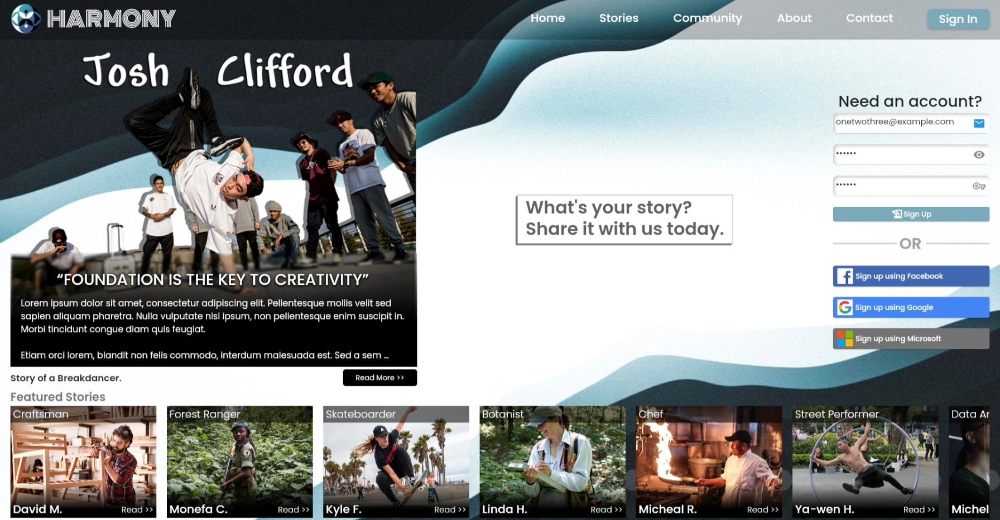
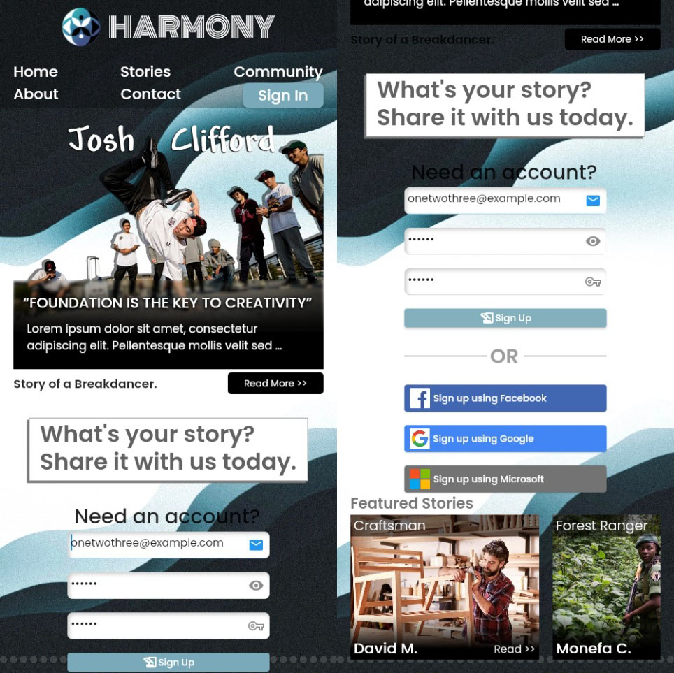

# online_service_homepage

Visit the working preview on [Harmony](https://harlanx.github.io/online_service_homepage/) deployed via Github Pages.

A responsive and adaptive online forum homepage website layout themed for a Community with interesting stories to tell. The website is created using Dart with Flutter SDK for Web (Hummingbird).

## Previews

https://user-images.githubusercontent.com/78299538/126614139-c1616f65-413d-468e-ba0c-004217f4fbb4.mp4

### Desktop

### Mobile

